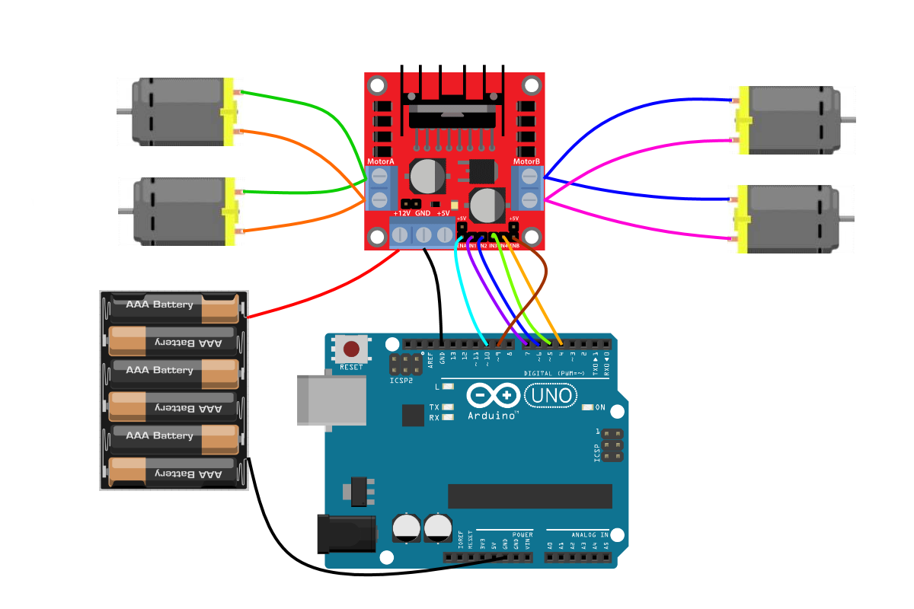
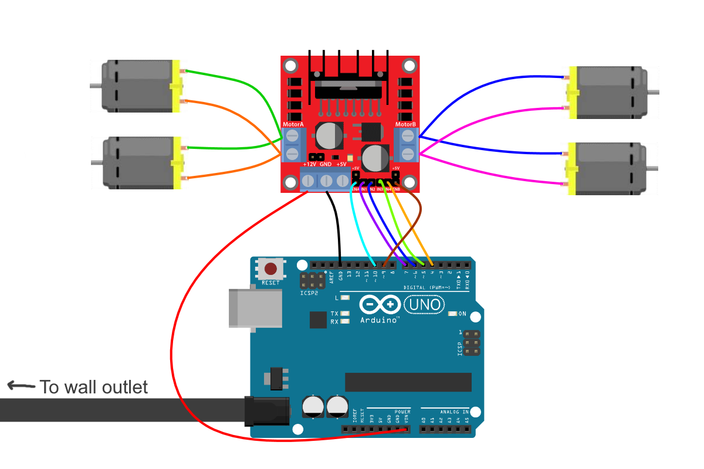

# L298N Motor Driver
An example code that can be used to test out the motors can be found in the current directory entitled: motorTest.ino  
This code tests hte motor functionality running forwards and backwards. It also tests out the speed control of the motors.  
The pins in the program match the pins in the wiring diagrams shown below.

##### Useful graphic for understanding how an H-Bridge works: 

### Common issues:
When powering 4 motors for tank drive, the two motors on the left should be in parallel with each other, and the two motors on the right should be in parallel with each other.  
In this configuration the motor driver typically needs to be supplied with ~9V. However, very often a 9V battery won't supply enough current for the motors to run. In addition, sometimes 4 AA batteries in series can power the motors, however once they drop just a little bit in voltage, they will no longer work.  
There are two ways to power it that should work consistently. If the student has a battery pack that can sit 6 AA batteries (or 2 battery packs that can be used in series), this will supply enough voltage and current to power the motors for a decent amount of time. If the student can't wire 6 AA batteries in series, then they can power Arduino using the wall adapter and then wire the V_in pin from Arduino into the +12V on the L298N.  
If the ESP32 must be used for the project, then this latter method can still work by using the Arduino as a power source for both the ESP32 and the L298N. In this case, connect the wall adapter to the Arduino, connect V_in from Arduino to the L298N's +12V pin. Then connect 3.3V and GND on the Arduino to 3V3 and GND on the ESP32 respectively.
Below are illustrations of these 2 methods of connecting: 
## Powering the Motor Driver
### Battery Power

---
### Wall Power

### Other issues:
Often the students won't realize that they must take the caps off of the EN_A and EN_B pins in order to allow them to control the speeds of the motor drivers. Some students also try to connect the wires to EN_A and EN_B with the caps still on top too. 
